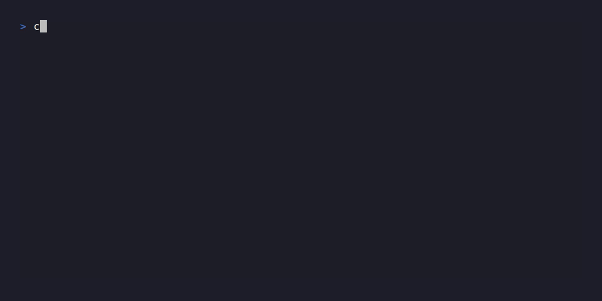
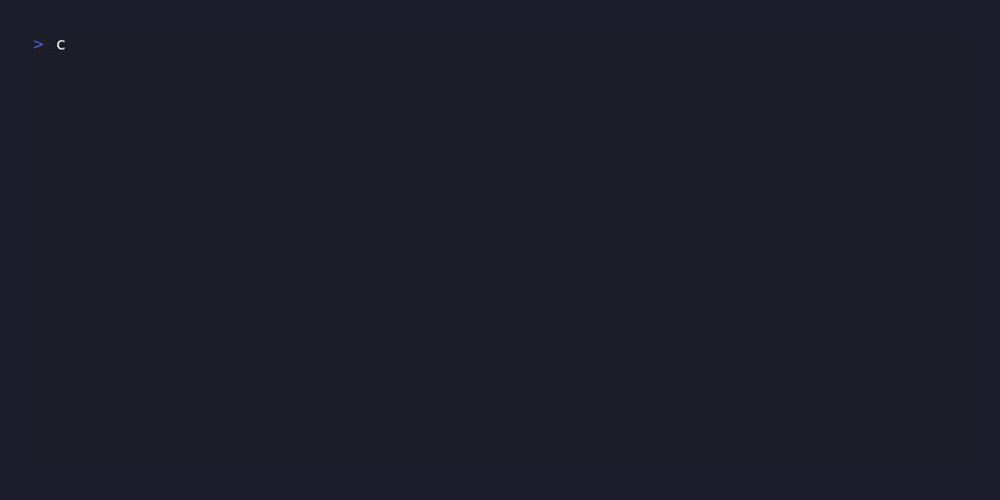

<div align="center">
  <picture>
    <source media="(prefers-color-scheme: dark)" srcset="cmd/decoreba-desktop/appicon-transparent.png">
    
  </picture>

  # decoreba

  Inline finder for the commands you use every day and never quite memorize.

  [](https://www.npmjs.com/package/decoreba)
  [](https://go.dev)
  [](https://github.com/matheuzgomes/decoreba/actions)
  [](LICENSE)
  <br>
  ~2 ms startup · 6.2 MB binary · zero dependencies

  [Features](#features) · [Install](#install) · [Quick start](#quick-start) · [Usage](#usage) · [Shell](#shell-integration) · [Sync](#gist-sync) · [MCP](#mcp-server)

</div>

<div align="center">
  
</div>

---

## Features

- **Inline overlay** — Opens below the cursor, not as a fullscreen app. Dismiss without trace. Pure ANSI escape codes, no libraries.
- **Fuzzy search + typo tolerance** — Damerau-Levenshtein distance catches typos. Accent normalization (`próximo` matches `proximo`).
- **Recency ranking** — Score = fuzzy match + usage count + exponential decay (48h half-life). Pinned commands stay at top.
- **Workflows** — Multi-step commands with interactive runner. Each step is a title + command pair. `Enter` steps forward, `Ctrl+X` runs all.
- **Zero dependencies** — Pure Go standard library. No ncurses, no fzf, no daemon. Single 6.2 MB binary.
- **MCP server** — Model Context Protocol over stdin/stdout. Lets AI agents search, add, edit, and execute from your vault.

---

## Install

```bash
npm install -g decoreba
```

Downloads a prebuilt binary for your platform. No Go toolchain needed.

```bash
go install github.com/matheuzgomes/decoreba/cmd/decoreba@latest
```

## Quick start

```bash
decoreba                    # auto-detect context from cwd
decoreba git                # search within "git" context
decoreba add                # add a command
decoreba edit 0c9           # edit by id prefix
decoreba stats              # vault statistics
```

See the full reference below.

---

## Usage

### Palette

The overlay appears below your prompt, not fullscreen. Type to fuzzy-search.
`Enter` copies the command. `Ctrl+X` executes it.

> [!NOTE]
> `Shift+Enter` also executes, but only in terminals that implement the
> [kitty keyboard protocol](https://sw.kovidgoyal.net/kitty/keyboard-protocol/)
> (kitty, WezTerm, Ghostty). In most terminals `Shift+Enter` sends the same
> byte as `Enter` and will copy instead.

When results exceed the viewport, an overflow indicator appears (`… 3 more`).
If the terminal is 3 rows or shorter, a graceful message is shown instead.
`NO_COLOR` or `--no-color` disables all ANSI codes.

### Keybindings

**Universal** (every terminal emulator)

| Key | Action |
|---|---|
| `↑` / `Ctrl+K` | Navigate up |
| `↓` / `Ctrl+J` | Navigate down |
| `Enter` | Copy selected |
| `1` – `9` | Direct select (empty search) |
| `Ctrl+X` | Execute selected (press twice, or `y` to confirm) |
| `Ctrl+E` | Edit selected |
| `Ctrl+S` | Toggle pin |
| `Backspace` (empty) | Remove context chip |
| `Tab` / `Shift+Tab` | Next / previous field (form) |
| `Esc` / `Ctrl+C` | Cancel |

**Kitty protocol only** (kitty, WezTerm, Ghostty)

| Key | Action |
|---|---|
| `Shift+Enter` | Execute selected |

### Execute mode

`Ctrl+X` triggers execution. A confirmation prompt appears:
`Run this command? y/yes n/no`. Press `Ctrl+X` again or `y` to confirm.
Any other key cancels.

With `--shell-output`, the command text is printed to stdout instead of the
clipboard. The shell widget (below) strips the prefix automatically:

```bash
decoreba docker ps --shell-output   # prints "✓ docker ps" or "EXEC:docker ps"
```

### Add / Edit form


Five fields: context, title, command, tags, notes. Context autocompletes from
existing entries. Tags render as colored chips. `Ctrl+W` turns the command
into a multi-step workflow editor.

`decoreba edit <id>` or `Ctrl+E` from the palette reopens the form pre-filled.

### Workflows

Commands can have multiple steps. Each step is a title + command pair.

<div>
  
</div>

`Enter` runs the next step. `Ctrl+X` runs all remaining (confirms first).
`Esc` aborts. Failed steps show `✗`. Subprocess I/O routes through `/dev/tty`
so interactive programs still work when piped.

### Variables

Use `{{placeholder}}` or `{{name:default}}` in any command. On copy or
execute, decoreba prompts for each value inline:

```text
$ decoreba deploy

  Container name: [web]
```

<div>
  
</div>

---

## Shell integration

### Completions

Generate tab completions for subcommands, contexts, and sync actions:

```bash
eval "$(decoreba completion bash)"   # or zsh / fish
```

### Ctrl+O widget

Opens the palette pre-filled with whatever you typed. `Enter` inserts the
command at the cursor. `Ctrl+X` executes (confirms first).

```bash
source <(decoreba shell bash)   # or zsh
```

### Init

Installs both widget and completions into your shell rc file in one step.
Creates a backup before modifying.

```bash
decoreba init              # interactive
decoreba init --yes        # non-interactive
```

---

## Gist sync

Sync your vault across machines via a private GitHub Gist.

```bash
decoreba sync init          # create a new Gist and upload
decoreba sync push          # upload local changes
decoreba sync pull          # download remote changes
decoreba sync status        # show ahead/behind/diverged/clean
```

Requires `DECOREBA_GIST_TOKEN` (classic PAT with `gist` scope). Pass
`--encrypt` to encrypt with AES-256-GCM before upload. The key is derived
from the token.

---

## MCP server

Runs a [Model Context Protocol](https://modelcontextprotocol.io) server over
stdin/stdout. Lets AI agents (Claude Desktop, Cline, etc.) interact with
your command vault directly.

```bash
decoreba mcp
```

| Tool | Action |
|---|---|
| `decoreba_search` | Fuzzy search across all contexts |
| `decoreba_get` | Look up a command by ID |
| `decoreba_list_contexts` | List all contexts with counts |
| `decoreba_add` | Add a new command |
| `decoreba_edit` | Update an existing command |
| `decoreba_remove` | Delete by ID |
| `decoreba_execute` | Run a command and return output |
| `decoreba_stats` | Vault statistics |

Write and delete tools require `confirm: true`. Dangerous commands
(`rm -rf /`, `> /dev/sda`, etc.) are blocked by a built-in denylist.
Auto-backup runs before every modification.

---

## Data

Single JSON file. Atomic writes (save to `.tmp`, rename over target).

| OS | Path |
|---|---|
| Linux | `$XDG_CONFIG_HOME/decoreba/commands.json` |
| macOS | `~/Library/Application Support/decoreba/commands.json` |
| Windows | `%AppData%\decoreba\commands.json` |

Override the directory with `$DECOREBA_CONFIG` (the filename is always
`commands.json`).

---

## Performance

| Metric | Value |
|---|---|
| Binary | 6.2 MB (CLI, stripped with `-s -w`) |
| Startup | ~2 ms |
| RSS | ~7 MB |
| Dependencies | zero (pure Go stdlib) |
| Targets | linux amd64/arm64, macOS amd64/arm64, windows amd64 |

---

## Design

- **Appear, don't replace.** Inline overlay, not alternate screen. The terminal is exactly as it was before.
- **Right answer before you finish typing.** Fuzzy + typo tolerance + recency + pinning.
- **Keyboard-first.** Every action has a shortcut. The hint line teaches them progressively. No mouse.
- **Context over categories.** Commands live under the tool they belong to. Auto-detection from cwd.
- **Accessible.** `NO_COLOR` and `--no-color` disable all ANSI escape codes.
